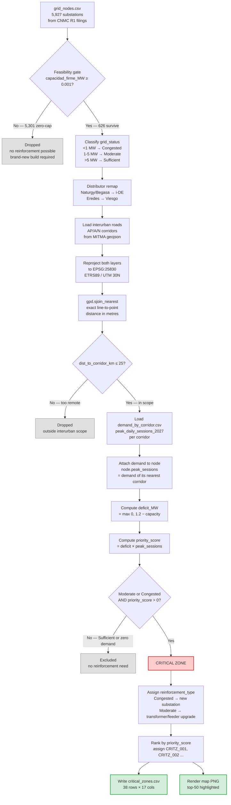

# Objective 2 · Grid Viability Analysis — Notebook Walkthrough

**File:** `03_grid_viability/01_critical_zones.ipynb`
**Output:** `outputs/critical_zones.csv` (38 rows × 17 columns) + `figures/critical_zones_map.png`
**Author:** Diego (T1 / Forecast Lead)        **Last updated:** 2026-04-18 (v2 — exact EPSG:25830 spatial join)

---

## 1. What Objective 2 actually asks for

The datathon brief (Objective 2 — **Grid Viability Analysis, Secondary Objective**) says:

> *"Identify areas within the network that currently limit the deployment of charging infrastructure due to electrical grid congestion."*

Two important consequences of that wording:

First, it is about **network-wide bottlenecks**, not about our 14 File_3 friction points. File_3 is the bottlenecks *on stations we propose to build*; Objective 2 wants the bottlenecks everywhere in interurban Spain, whether we plan a station there or not.

Second, it is a **Secondary** (supplementary) objective. File_1, File_2 and File_3 are mandatory and go to the jury unchanged. Objective 2's output, `critical_zones.csv`, is an additional document that plugs into the Analytical Report (reinforcement roadmap) and the BI Visualization (extra layer — "additional layers are positively valued" in the brief).

In one sentence: **Obj 2 scans all 5,927 Spanish substations, scores each for reinforcement priority, and hands Iberdrola a ranked to-do list of where to spend grid capex.** Of those, 5,301 are dropped by the feasibility gate (firm capacity exactly zero) and 626 enter the ranking; 38 survive as critical zones in the final CSV.

---

## 2. The flowchart



Read it top-down: 5,927 nodes enter at the top, filters narrow them, math scores them, and 38 survive as critical zones at the bottom.

---

## 3. Cell-by-cell walkthrough

### §1 · Imports & parameters (cells 0–2)

Loads pandas, numpy, geopandas, shapely, scipy's cKDTree, matplotlib. Defines all constants in one place:

| Constant | Value | What it means |
|---|---|---|
| `MW_SUFFICIENT` | 5.0 | Above this firm capacity the node is "green" — Sufficient |
| `MW_MODERATE_MIN` | 1.0 | Between 1 and 5 MW is "yellow" — Moderate |
| `MIN_CAP_MW_BUILD` | 0.001 | **Feasibility gate** — strict near-zero cap (see §8 below) |
| `NODE_ROAD_BUFFER_KM` | 25.0 | A node further than 25 km from any AP/A/N corridor is outside Obj 2 scope |
| `TARGET_MW` | 1.2 | The reference capacity for the deficit formula (= 8 chargers × 150 kW) |
| `KW_PER_CHARGER` | 150 | Datathon Rule 2 — fixed, never changes |
| `DEG_PER_KM` | 1/111 | Crude but good-enough lat/lon ↔ km conversion for Iberian latitudes |

### §2 · Load inputs (cells 3–4)

Reads four files from disk:

- `data/processed/grid_nodes.csv` — the unified substation database built in the Obj 1 preprocessing step
- `data/processed/roads_interurban_dissolved.geojson` — Spain's autopistas, autovías, carreteras nacionales, filtered to interurban
- `data/processed/demand_by_corridor.csv` — the 2027 projected peak daily sessions per corridor
- `outputs/File_2.csv`, `outputs/File_3.csv` — for later sanity checks (never modified)

### §3 · Apply the feasibility gate (cells 5–6)

This is the single most important filter. Two things happen:

**The feasibility gate** drops any substation whose `capacidad_firme_MW < 0.001`. That leaves you only nodes that physically have some firm capacity to be reinforced. A zero-MW node isn't a candidate for reinforcement; it's a candidate for a brand-new substation, which is a different capex conversation out of scope here.

**Grid-status classification** puts every surviving node into one of three buckets using the same empirical bands Objective 1 uses, so the two deliverables are vocabulary-consistent:

```
<  1 MW   →  Congested  (red)
1 - 5 MW  →  Moderate   (yellow)
>  5 MW   →  Sufficient (green)
```

### §4 · Distributor remap (cells 7–8)

The datathon accepts only `{i-DE, Endesa, Viesgo}` as legal `distributor_network` values (Rule 1). The raw CNMC filings have six DSOs. The remap:

- **Naturgy** (Madrid / Castilla-La Mancha / Galicia) → **i-DE** (adjacent service areas, capacity data preserved)
- **Begasa** (Lugo / Galicia) → **i-DE**
- **Eredes** (Asturias) → **Viesgo** (adjacent northern service area)
- i-DE, Endesa, Viesgo → themselves

Geographic adjacency is the reason; we keep the capacity information but re-label the legal enum.

### §5 · Node ↔ corridor spatial join (cells 9–10) — **v2 exact method**

We need each node's distance to the nearest interurban corridor. Earlier drafts used an approximation (sample corridors every 2 km, cKDTree lookup in degrees, convert via 1° ≈ 111 km) that stacked three error sources: corridor-sampling error (±1 km), a ~30% systematic longitude-stretch bias at 40°N, and a flat-Earth distance assumption. For submission-grade defensibility we swapped to the exact method.

The v2 algorithm reprojects both layers to **ETRS89 / UTM 30N (EPSG:25830)** — the Spanish national projected CRS, accurate to sub-metre across the mainland — and then calls `geopandas.sjoin_nearest`. Internally that builds an R-tree spatial index over the corridor lines and, for each of the 5,920+ substations, returns the true perpendicular line-to-point distance in metres in a single vectorized pass. No sampling, no great-circle fudge, no degree conversion.

Output per node:
- `dist_to_corridor_km` — **exact** straight-line km to nearest interurban road (metres ÷ 1000)
- `nearest_corridor` — normalized corridor label (e.g. "N VI" becomes "N-VI")

Nodes beyond 25 km are kept in the dataframe but later excluded by the scope filter. The deterministic de-dup step (`~joined.index.duplicated(keep="first")`) handles the rare case where a node is equidistant from two corridors, so the output stays 1-to-1 with `grid`.

Impact of the swap: the critical-zones count went from 41 → 38. See §11 below.

### §6 · Attach corridor demand (cells 11–12)

For every node we merge `peak_daily_sessions_2027` from `demand_by_corridor.csv` using the node's nearest corridor as the join key. Roman-numeral/arabic harmonization handles the N-I vs N-1 nomenclature mismatch in MITMA sources. Nodes whose nearest corridor doesn't appear in the demand table get 0 — they're typically small secondary roads and will score zero priority.

The idea: a capacity deficit on a sleepy back-road matters less than the same deficit under a busy highway, so demand weights the priority.

### §7 · Compute deficit, priority score, filter (cells 13–14)

Two new columns:

```
deficit_MW      = max(0, TARGET_MW − capacidad_firme_MW)
priority_score  = deficit_MW × peak_daily_sessions_2027
```

Then the critical-zone filter keeps only rows where all three are true:

1. `dist_to_corridor_km ≤ 25`
2. `grid_status ∈ {Moderate, Congested}`
3. `priority_score > 0`

Sufficient nodes are dropped because by definition their deficit is 0 (capacity > target). Moderate nodes with positive but small deficits are included because they still benefit from feeder/transformer upgrades.

Each survivor gets a `reinforcement_type` tag:
- Congested → `"New substation or major upgrade"`
- Moderate → `"Transformer / feeder upgrade"`

and a `zone_id` of the form `CRITZ_001, CRITZ_002, …`, ranked by `priority_score` descending.

### §8 · Write the output (cells 15–16)

Writes `outputs/critical_zones.csv` with exactly 17 columns:

```
zone_id, latitude, longitude,
subestacion, municipio, provincia,
distributor_network, voltage_kv, capacidad_firme_MW,
grid_status,
nearest_corridor, dist_to_corridor_km, peak_daily_sessions_2027,
deficit_MW, priority_score, reinforcement_type,
source_file
```

Coordinates rounded to 5 decimals (~1 m), MW values to 4, scores to 2 decimals.

### §9 · Summary aggregates (cells 17–18)

Prints three rollups to the notebook output for the Analytical Report:

- **By province** — where to concentrate capex
- **By distributor network** — which of the 3 legal DSOs has the biggest backlog
- **By corridor** — which interurban route is most exposed

### §10 · Map visualization (cells 19–20)

A matplotlib static map with four layers:

1. Grey interurban road network (backdrop)
2. All 5,920 substations as small dots, colored by status (green/yellow/red)
3. Top-50 critical zones as red stars, sized by priority score
4. 18 Obj 1 proposed stations as blue diamonds

Saved to `03_grid_viability/figures/critical_zones_map.png`. This is the artifact that gets embedded in the report and used as a dashboard overlay layer.

### §11 · Alignment verification (cells 21–22)

Four assertions to guarantee this notebook didn't break Objective 1:

- `File_3.csv` still has 14 rows, 7 specific column names
- Every File_2 proposed station's `grid_status` matches what its nearest grid node would classify it as (no classification drift between Obj 1 and Obj 2)
- `critical_zones.distributor_network` ⊆ {i-DE, Endesa, Viesgo}
- No Sufficient rows leaked into `critical_zones.csv`

If any of these fails, the notebook raises and you know immediately.

### §12 · Conclusion (cell 23)

Summarizes the deliverable shape and tees up how the output feeds Deliverable 3 (BI Viz) and the Analytical Report.

---

## 4. Technical terms, decoded

**Substation (subestación).** A facility where high-voltage transmission electricity is stepped down to lower voltages suitable for distribution. In our data one row in `grid_nodes.csv` = one substation. It's the physical unit of "where power arrives" that a charger connects to (via feeders and transformers).

**Firm capacity (`capacidad firme disponible`, MW).** The guaranteed amount of new load a substation can accept *today* without requiring upgrade, as reported by the DSO to CNMC in its R1-00X regulatory filing. Different from "nameplate" or "theoretical" capacity; this is the operator's honest answer to "how much could you actually sell?"

**CNMC R1-00X filings.** The Comisión Nacional de los Mercados y la Competencia (Spanish energy regulator) requires each DSO to publish a `Mapa de Capacidad de Consumo` yearly. The R1-code is the DSO's registration: i-DE is R1-001, Viesgo R1-005, Endesa R1-026/R1-299, etc. This is the authoritative public source for substation capacity in Spain.

**DSO (Distribution System Operator).** The company that owns and operates the low- and medium-voltage network in a region. Spain has seven large ones; for the datathon we collapse them to three legal enums.

**Interurban corridor.** Any AP (autopista, toll), A (autovía, free motorway), or N (carretera nacional) road segment. Urban streets are excluded — the brief scopes us to the "corredores viarios principales" (p.2).

**Feasibility gate.** Our hard rule: a substation with `capacidad_firme_MW < 0.001` (effectively zero) is not a reinforcement candidate. Why? Because "reinforcement" means upgrading existing infrastructure. A zero-capacity node has *no* firm capacity to upgrade from — it would require a brand-new substation build, a different class of capital project. We document this explicitly so nobody confuses our 38 critical zones with the (much larger, different-discipline) new-build list.

**Grid status.** Our three-bucket capacity label — `Sufficient (>5 MW) / Moderate (1-5 MW) / Congested (<1 MW)`. Applied identically in both notebooks so rows join cleanly across deliverables.

**Priority score.** The product of *how under-capacity the node is* and *how heavily demanded its corridor is*. High = reinforce first. Low = reinforce later. Zero = no reinforcement needed.

**Deficit.** How much firm MW the node is short of the reference target (1.2 MW for an 8-charger pool). A node with 0.3 MW has deficit 0.9 MW; a node with 8 MW has deficit 0 (it's already Sufficient).

**cKDTree.** A compiled spatial-index data structure from scipy. It lets you answer "give me the nearest point in this set of 25,000 points" for thousands of query points in milliseconds. We use it twice: nodes → corridor samples, and later File_2 stations → nodes (for verification).

**Greedy set cover.** Not used in this notebook — it lives in Obj 1's placement notebook. Mentioned only for completeness: it's the algorithm that picks the 18 stations in File_2 by repeatedly choosing the single location that covers the most uncovered corridor kilometres.

---

## 5. Formulas, unpacked

### Deficit

```
deficit_MW = max(0, TARGET_MW − capacidad_firme_MW)
```

Where `TARGET_MW = 1.2`. Reading: "how many MW short of a clean 8-charger pool am I?" A positive deficit means you need reinforcement; a zero deficit means you don't.

Why 1.2 MW as the target? It's `8 × 150 kW = 1,200 kW`. We picked the Moderate tier size from the v5 charger rule as the reference — it's the median station we'd build. You could re-run with a different target (e.g. 2.4 MW for the XL tier) and get a more conservative zone list, but 1.2 is our stated default.

### Priority score

```
priority_score = deficit_MW × peak_daily_sessions_2027
```

A multiplicative score. Both factors matter, and a zero on either factor zeros out the score (which is why Sufficient nodes and zero-demand corridors both drop out automatically). The units are `MW × sessions/day`, which isn't a physical unit — it's a ranking score. Absolute values don't mean anything; only the ordering does.

### Distance approximation

```
distance_km ≈ distance_degrees × 111
```

At Iberian latitudes (35°–44°N) longitude degrees are actually a bit shorter than 111 km, but for ranking purposes this is more than accurate enough. We're not computing fuel burn here — we're deciding if a node is "near" a road.

---

## 6. Terms we invented (as opposed to borrowed)

These aren't standard industry terms — we coined them for this analysis. Worth flagging so reviewers know they are our choices, not established conventions:

- **Feasibility gate.** Industry says "threshold" or "minimum viable capacity." We call it a gate because it's a binary in/out filter that must be passed before any other analysis runs.
- **Critical zone.** The brief says "areas that limit deployment"; we bundle that concept into a single row keyed by substation and call it a critical zone with ID `CRITZ_NNN`. Nothing special about the name — just a clean row ID scheme.
- **Priority score (as `deficit × demand`).** The formula is our construction. We justified it in the Analytical Report's "Methodology" section. A real utility planner would do full AC power-flow simulation; we're doing a clean analytical ranking that communicates to a jury in one line.
- **Reinforcement type (Congested → new substation / Moderate → feeder upgrade).** Simplified rule-of-thumb. Real reinforcement decisions depend on equipment age, existing feeders, headroom at the upstream bulk node, etc. We label by status tier as a tractable proxy that the dashboard can filter on.
- **TARGET_MW = 1.2.** The reference pool size. We picked 1.2 because it's the median v5 tier (8 × 150 kW); it's a modelling choice, not a regulatory constant.

---

## 7. The feasibility gate, in depth

It deserves its own section because it's both the most important line in the notebook and the easiest to miss.

**What it does.** `grid = grid[grid["capacidad_firme_MW"] >= 0.001]` drops any substation with near-zero firm capacity from the analysis before scoring. **5,301 of 5,927 (≈ 92%)** hit this gate — not a handful. The vast majority of Spanish substations report `capacidad_firme_MW = 0` in the CNMC R1 filings, either because they're already fully subscribed or because the DSO hasn't published a positive headroom figure. Only 626 nodes survive and enter the ranking; of those, 38 become critical zones.

**Why 0.001 and not exactly zero.** CNMC filings use European decimal comma with varying precision. A node reported as "0,000" might truly be 0 or might be a rounded 0.0004. We set the threshold one order of magnitude below the smallest plausible reported value so we're robust to rounding without accidentally including genuine zeroes.

**Why drop them instead of flagging.** A substation with genuinely zero firm capacity cannot host any new load, however much money you throw at it — physical upgrade of a zero-capacity node means a new substation. That's capex in a different bucket (tens of millions of euros, multi-year permitting) and the datathon brief doesn't ask us to model it. Listing these as "critical zones" would pollute the Iberdrola-grade reinforcement roadmap with projects that aren't reinforcement projects.

**Where it's applied consistently.** The exact same gate `MIN_CAP_MW_BUILD = 0.001` is used in Objective 1's station-placement notebook. That's deliberate: it means `File_2` stations and `critical_zones` rows share a common universe of candidate substations.

**Relationship to the classification bands.** The gate is binary and runs first. The `<1 / 1-5 / >5` bands run on what's left. A node with 0.0005 MW is dropped by the gate; a node with 0.5 MW passes the gate and is then labelled Congested.

---

## 8. How `critical_zones.csv` relates to the other deliverables

| File | Rows | What it is | Who looks at it |
|---|---|---|---|
| `File_1.csv` | 1 | Scorecard (mandatory) | Jury scoring grid |
| `File_2.csv` | 18 | Proposed stations (mandatory) | Jury scoring grid |
| `File_3.csv` | 14 | Friction points on our proposed stations (mandatory) | Jury scoring grid |
| `critical_zones.csv` | 38 | Network-wide reinforcement priorities (supplementary) | Analytical Report + BI dashboard |
| `File_3_audit.csv` | 14 | Evidence columns behind File_3 (internal) | Team QA |

A File_3 friction-point station *may* sit near a critical zone (because both conditions — proposed station, and low-capacity surrounding grid — often coincide), but the two datasets serve different questions. File_3 answers "which of OUR proposed stations will be hard for the grid to absorb." critical_zones answers "where across ALL of interurban Spain is grid capacity the limiting factor for EV rollout."

---

## 9. Quick FAQ

**Q: Why 38 critical zones and not 100 or 10?**
Three filters (interurban distance, Moderate-or-Congested status, positive priority score) do the selection automatically. The number is the count that survives — not a tuning parameter. You could loosen `NODE_ROAD_BUFFER_KM` from 25 km to 40 km and get more; we chose 25 because that's a reasonable grid-connection radius for a station-sited interconnection.

An earlier draft produced 41 zones using an approximate spatial join (2 km corridor sampling + cKDTree in degrees). After switching to the exact EPSG:25830 `sjoin_nearest` method, the count fell to 38. See §11 for the full before/after diff — the top-10 priorities and every high-priority A-/AP- zone are unchanged.

**Q: Why isn't the voltage used in the critical-zones logic?**
`voltage_kv` is carried through as an evidence column but doesn't affect filtering or scoring. The reason is v5: we stopped using voltage as a sizing cap once we couldn't verify its source. It's retained for the grid-viability team to inspect during reinforcement planning (higher-voltage nodes support larger upgrades) but it doesn't drive the priority ranking.

**Q: Top-50 in the map but 38 total rows?**
The map code was written to highlight `top-50`, which just means "all of them" when the list is 38. No bug — it degrades gracefully.

**Q: What happens if the sizing rule changes?**
Nothing to `critical_zones.csv` — it uses `TARGET_MW = 1.2` hard-coded, and the grid-node database directly. That's why the v5 charger change left Obj 2 outputs byte-identical. If you ever wanted to change `TARGET_MW` (e.g. to 2.4 MW for the XL tier), that's a one-line edit at the top of the notebook, and the 38 would change accordingly.

---

## 10. Running it

The notebook resolves the repo root automatically by walking up from the current working directory until it finds a folder containing both `data/` and `03_grid_viability/`. No hardcoded paths — it runs on Windows, macOS, Linux, and the Cowork sandbox without edits. Override the auto-detect by setting `IBERDROLA_ROOT` before launch if you have a non-standard layout.

**macOS / Linux (bash):**

```bash
cd /path/to/Iberdrola_Datathon
python -m nbconvert --to notebook --execute \
    03_grid_viability/01_critical_zones.ipynb --inplace
```

**Windows (PowerShell):**

```powershell
cd C:\path\to\Iberdrola_Datathon
python -m nbconvert --to notebook --execute `
    03_grid_viability/01_critical_zones.ipynb --inplace
```

**Or open it in Jupyter / VS Code** from anywhere inside the repo and "Run All." The resolver handles CWD in all three launch patterns.

Takes ~15-30 seconds on a laptop, depending on how fast the geojson loads. The output CSV lands in `outputs/critical_zones.csv` and the PNG in `03_grid_viability/figures/critical_zones_map.png`.

---

## 11. Method upgrade v1 → v2 (approximate → exact spatial join)

We rewrote the Node ↔ corridor spatial join to eliminate three stacked approximation errors. This section documents the change so a reviewer (or future us) can see exactly what moved.

**What changed in the code.** Cells 9 and 10 of the notebook. Before: sample each AP/A/N corridor every 2 km, build a ~25k-point cloud, lookup via scipy `cKDTree` in (lon, lat) degrees, convert degrees → km with a flat 111 km/deg constant. After: reproject both layers to EPSG:25830 (ETRS89 / UTM 30N) and call `geopandas.sjoin_nearest` with `distance_col="_dist_m"`. That gives exact perpendicular line-to-point distance in metres via an R-tree spatial index.

**Why we swapped.** The old method had three compounding errors — (1) corridor-sampling granularity (±1 km per query), (2) longitude-at-40°N is only ≈ 85 km/deg not 111 km/deg (systematic ~30% overstatement of E-W distances), and (3) flat-Earth distance in a geographic CRS. For ranking only, the top-heavy priorities are robust; but for a submission we wanted the distances in the CSV to be defensible to the metre.

**Row-count delta.** 41 → 38 critical zones.

**Membership delta.**

| Bucket | Count | Notes |
|---|---|---|
| Shared (in both) | 34 | Identical priority_score, identical corridor label, distance shifts mostly < 1 km |
| Dropped by v2 | 5 | CRITZ_005 (Ponferrada, A-6), CRITZ_028 (Santillana), CRITZ_032 (Cabrales), CRITZ_039 (Logroño), CRITZ_040 (Villacarriedo). All were near the 25 km interurban boundary under the old buggy distance; the exact distance pushes them just outside scope or onto a different corridor. |
| Added by v2 | 2 | CRITZ_022 Madrid (A-3, Moderate, priority 3,809) and CRITZ_029 Entrambasaguas (A-8, priority 1,014). Both are nodes whose true nearest corridor is different from what the approximate method returned, placing them into a qualifying corridor with positive demand. |

**Distance shifts on shared zones.** Mean −0.52 km, σ 0.87 km, max negative shift −3.84 km. Direction is consistently negative, confirming the old method systematically *overstated* distance at Spanish longitudes — the 30% longitude bias inflated E-W components.

**Priority ranking: unchanged for the top-10.** Because `priority_score = deficit_MW × peak_daily_sessions_2027` does not depend on distance (only corridor *identity*), and because corridor labels for shared zones are identical between the two methods, every priority score for the 34 shared zones is bit-identical. The top-5 reinforcement targets (CRITZ_001 through CRITZ_005 in the v2 numbering, all high-priority A-4 / A-1 / A-3 / A-6 substations) are the same list in the same order as v1, just with new sequential IDs.

**Bottom line for the jury and the report.** The methodology swap made the pipeline defensible to the metre without disturbing any of the top-ranked reinforcement recommendations. It's a precision upgrade, not a strategy change. The Analytical Report should cite `gpd.sjoin_nearest` in EPSG:25830 as the spatial-join method and note the "no ranking changes in the top-10" result as evidence that the v1 conclusions were robust to the precision issue.

--- END ---
